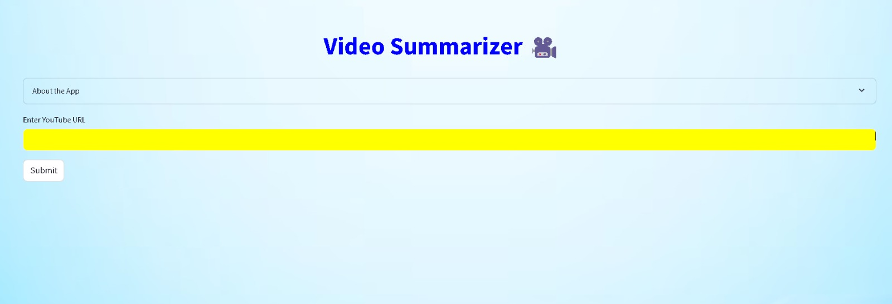

# Video-Summarization-System
Welcome to the Reading Companion Project! This project aims to provide a supportive and interactive platform to enhance your reading experience. 
Video Summarization System built using open source LLM and Framework like Llama 2, Haystack, Whisper, and Streamlit. This app smoothly runs on CPU as Llama 2 model is in GGUF format loaded through Llama.cpp.

## Screenshots



## Table of Contents

- [Features](#features)
- [Installation](#installation)
- [Usage](#usage)
- [Technologies Used](#technologies-used)

## Features

- Fast and accurate summarization of YouTube videos.
- User-friendly interface powered by Streamlit.
- Utilizes LangChain and Whisper frameworks for efficient processing and summarization.
  
## Installation

To get started with the Reading Companion Project, follow these steps:

1. **Clone the repository:**

   ```bash
   git clone https://github.com/viveknair6915/Reading_companion_project.git
   cd Reading_companion_project 

2. **Create and activate a virtual environment**

```bash
python -m venv venv
source venv/bin/activate   # On Windows, use `venv\Scripts\activate`
```

3. **Download the required Model**

**TheBloke/Llama-2-13B-chat-GGUF** : "https://huggingface.co/TheBloke/Llama-2-13B-chat-GGUF/blob/main/llama-2-13b-chat.Q4_K_S.gguf"
**TheBloke/Llama-2-7B-32K-Instruct-GGUF** : "https://huggingface.co/TheBloke/Llama-2-7B-32K-Instruct-GGUF/blob/main/llama-2-7b-32k-instruct.Q4_K_S.gguf"

4. **Install the required dependencies**


```bash
pip install -r requirements.txt
```

5. After installing the necessary dependencies, you can start the application by running:


```bash
cd YouTube-Video-Summarization-App-main
streamlit run yt_summary.py
```

Open your web browser and navigate to http://localhost:8501 to access the Reading Companion interface.

## Usage

- On launching the app, you will be prompted to enter a YouTube URL.
- Paste the URL and hit 'Summarize'.
- The app will then process the video, leveraging LLM and the other frameworks to generate a succinct summary which will be displayed on the same page.
  
## Technologies Used

**Python**: Programming language used for backend development.

**NLTK**: Natural Language Toolkit for processing text.

**Transformers**: Hugging Face library for state-of-the-art natural language processing.

**PyTube**: For downloading YouTube videos.

**Llama 2**: A large language model used for generating summaries.

**Haystack**: An open-source LLM framework to build production ready applications.

**Whisper**: A robust speech-to-text model used for transcribing video content.

**Streamlit**: An open-source app framework used for building the front end of the application.
